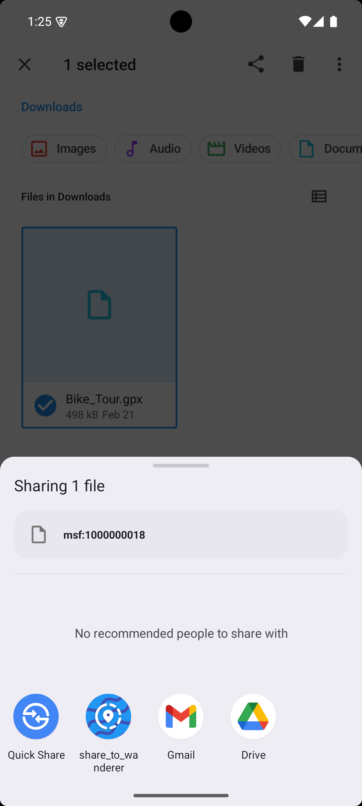

    

# Share to Wanderer

This is an unofficial companion app for [Wanderer](https://github.com/Flomp/wanderer). It allows you to upload tracks from your device to your Wanderer instance. You can also share tracks from other applications with the app and have them uploaded automatically. For example, if you recorded your track using [OpenTracks](https://github.com/OpenTracksApp/OpenTracks), you can share it with that app and have it uploaded to your Wanderer instance.

The app is built with [Flutter](https://github.com/flutter/flutter) and uses **Material You**. The app is currently available for **Android** only.

## 📦 Installation

## 💪 Features

- Connect to your Wanderer instance
- Test the connection to your Wanderer instance
- Upload one or more tracks from the application
- Share tracks from other apps with the app and have them automatically uploaded

## 🖼️ Impressions

    
    
    

## 🚀 Contributing

You can of course open issues for bugs, feedback, and feature ideas. All suggestions are very welcome :)

## 📜 Credits

- [Wanderer](https://github.com/Flomp/wanderer)
- [Flutter](https://github.com/flutter/flutter)
- [IconKitchen](https://icon.kitchen)
